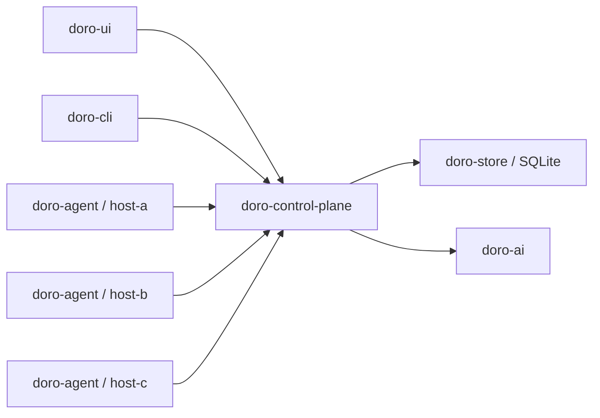

# Architecture

Doro uses a hub-and-spoke architecture.

The control plane is authoritative for desired state, task lifecycle, approvals, and audit history. Agents are authoritative for local host observations and local execution results.

Agents connect outbound to the control plane over WebSocket at `/api/v1/agent/connect`. This keeps the model compatible with NAT and home networks where inbound access to every host is undesirable.

The UI uses REST APIs for query and mutation, plus SSE at `/api/v1/events` for realtime updates. Agent traffic uses a separate WebSocket channel because agents need bidirectional task dispatch and event reporting.

Trust boundaries:

- Browser to control plane: authenticated user/API session.
- Control plane to store: local trusted persistence boundary.
- Agent to control plane: enrolled agent identity and transport security.
- AI to control plane: advisory planning only; policy and approval remain control-plane responsibilities.
