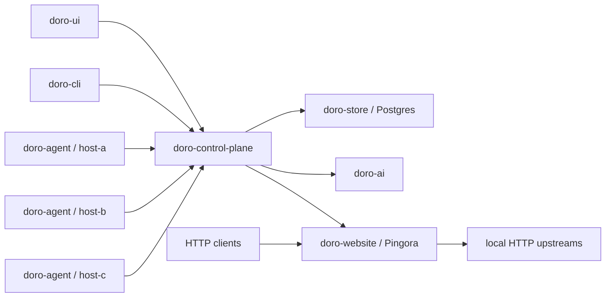

# Architecture

Doro uses a hub-and-spoke architecture.

```mermaid
flowchart LR
    UI["doro-ui"] --> CP["doro-control-plane"]
    CLI["doro-cli"] --> CP
    CP --> Store["doro-store / Postgres"]
    CP --> AI["doro-ai"]
    Internet["HTTP clients"] --> Sites["doro-website / Pingora"]
    CP --> Sites
    Sites --> Upstream["local HTTP upstreams"]
    A1["doro-agent / host-a"] --> CP
    A2["doro-agent / host-b"] --> CP
    A3["doro-agent / host-c"] --> CP
```

The control plane is authoritative for desired state, task lifecycle, approvals, and audit history. Agents are authoritative for local host observations and local execution results.

Agents connect outbound to the control plane over gRPC using the `doro.agent.v1.AgentControlPlane` service. This keeps the model compatible with NAT and home networks where inbound access to every host is undesirable.

The UI uses REST APIs for query and mutation, plus SSE at `/api/v1/events` for realtime browser updates. Agent traffic uses a separate gRPC/Protobuf contract because agents need typed enrollment, heartbeat, event streaming, and command dispatch.

Website traffic is served by an embedded Pingora proxy from `doro-website`. The control plane stores website desired state, creates approvals for network exposure, and hot-reloads Pingora routes after approved changes. Pingora handles runtime HTTP proxying only; it does not bypass the control plane for configuration or persistence.

Trust boundaries:

- Browser to control plane: authenticated user/API session.
- HTTP client to Pingora: public website traffic matched by Host header and route table.
- Control plane to store: trusted persistence boundary configured through `doro-config`.
- Agent to control plane: enrolled agent identity and transport security.
- AI to control plane: advisory planning only; policy and approval remain control-plane responsibilities.
